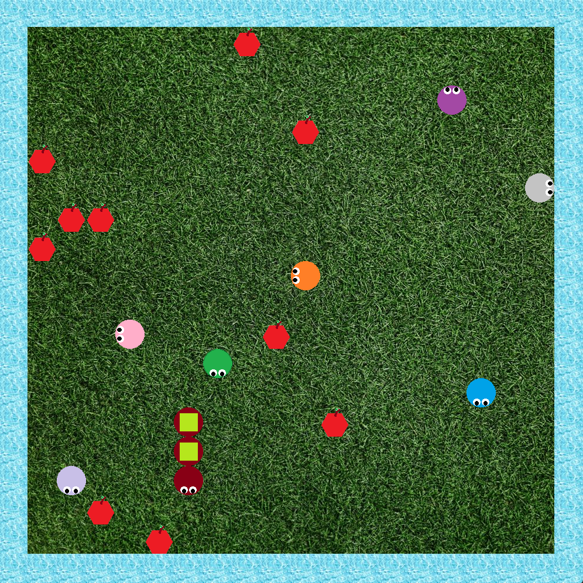

# Snake
Snake con multithreading in Java

## Come eseguire

Per eseguire il programma chiamare il metodo `main` del file `Main.java`

## Come giocare

Il giocatore controlla il serpente verde. Per muovere il serpente usare le frecce direzionali

## Descrizione progetto
- Per ogni serpente esiste un thread che si occupa di calcolare la sua prossima posizione
- I serpenti NPC (guidati dal computer) calcolano la prossima mossa in modo da evitare muri e altri serpenti
